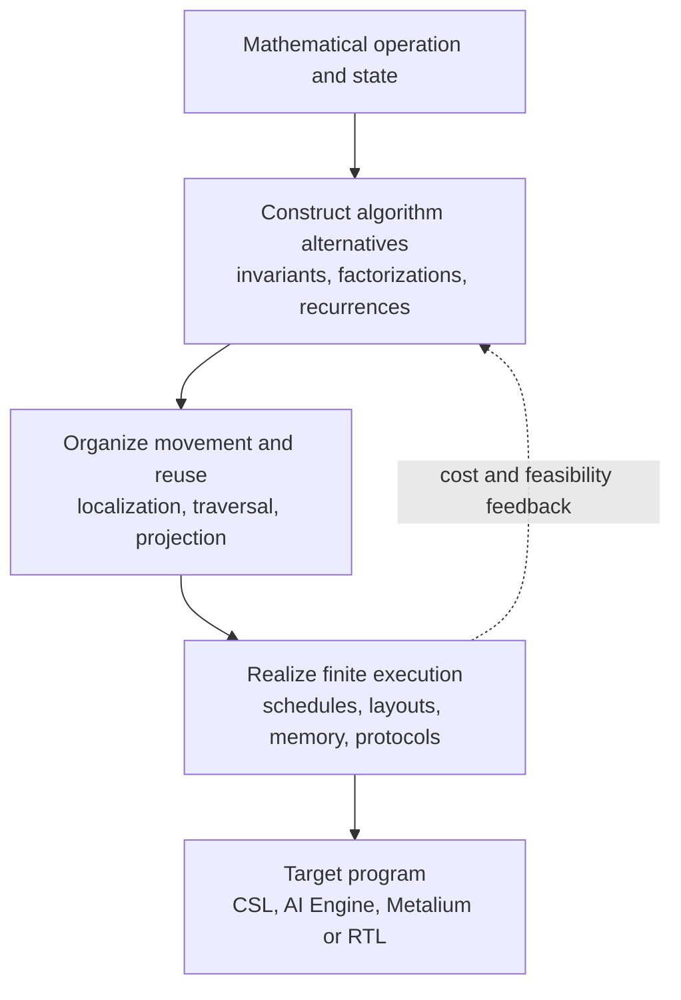

# Dataflow Programming Literatures

How can a mathematical algorithm become an efficient program distributed across processing elements, local memories and communication links? This collection studies that question through **constructive algorithm design and spatial compilation**.

The history brings together several distinct ideas. MIMD classifies instruction and data streams; process networks define communicating computations; systolic methods construct regular movement and reuse. Invariant-based development chooses which partial results an algorithm maintains. Recurrence transformations localize shared values and allocate dimensions to space and time. Transform generators search factorizations and permutations. Scheduling and dataflow models then address finite compute, storage and communication resources.

Modern systems connect these methods to FPGA HLS, programmable arrays and tensor compilers. Halide, Exo, Allo, DaCe, Calyx and MLIR expose different parts of the design space. Cerebras CSL, AMD AI Engine/IRON and Tenstorrent Metalium make the remaining execution decisions concrete. For readers familiar with CUDA, tiling and asynchronous transfers are familiar starting points; the additional question here is how to construct and compose persistent, communicating PE programs.

The English manuscript, **[From Algorithm Semantics to Processing Elements: A Survey of Spatial High-Level Synthesis](notes/spatial-hls-survey.pdf)**, includes worked FIR, FFT and GEMM derivations, numerical and stateful algorithm comparisons, concrete backend snippets, design synthesis and reproducibility appendices. **[TeX source](notes/spatial-hls-survey.tex)** · **[Portable source package](notes/spatial-hls-survey-source.zip)** · **[Build instructions and chapter guide](notes/literature-review.md)**. Author: Lingzhi Yang, Stony Brook University.

[papers/](papers/) contains selected PDFs, [metadata](papers/metadata.json) and [BibTeX](papers/references.bib). [notes/](notes/) contains the manuscript, [reading notes](notes/reading-notes.md), [source inspection](notes/code-ecosystem.md), [research revisions](notes/research-revisions.md) and [prototype design](notes/pragma-hls-design.md). The supporting implementation and frozen bounded experiment are in **[MIMD_dataflow](https://github.com/lingzhi227/MIMD_dataflow/blob/main/docs/research/spatial-contracts.md)**. The proposed general compiler is broader than that experiment.

## Papers

69 selected works, newest first. The table gives a short author label; complete author lists, versions, reading scope and source provenance are in the metadata. A catalogue entry does not imply full-paper reading or experimental reproduction. Stored PDFs are unchanged copies with recorded redistribution permission; other entries link to the original source.

| Year | Paper | Authors | Venue | Main content | PDF |
|---|---|---|---|---|---|
| 2026 | [Eliminating Redundancy: Ultra-compact Code Generation for Programmable Dataflow Accelerators](https://research.ibm.com/publications/eliminating-redundancy-ultra-compact-code-generation-for-programmable-dataflow-accelerators) | Prasanth Chatarasi et al. | CGO | Addresses finite instruction storage through compiler transformations that compact generated code. | [Source](https://research.ibm.com/publications/eliminating-redundancy-ultra-compact-code-generation-for-programmable-dataflow-accelerators) |
| 2026 | [Is It a Good Idea to Build an HLS Tool on Top of MLIR? Experience from Building the Dynamatic HLS Compiler](https://arxiv.org/abs/2603.19856) | Jiahui Xu et al. | LATTE workshop | Reports practical benefits and difficulties of building an HLS compiler on MLIR. | [PDF](papers/xu2026mlir.pdf) |
| 2025 | [A System Level Compiler for Massively-Parallel, Spatial, Dataflow Architectures](https://arxiv.org/abs/2506.15875) | Dirk Van Essendelft et al. | preprint | Describes MACH, a system-level spatial compiler using a distributed controller/worker virtual machine. | [PDF](papers/vanessendelft2025.pdf) |
| 2025 | [ARIES: An Agile MLIR-Based Compilation Flow for Reconfigurable Devices with AI Engines](https://www.jinmingzhuang.com/publication/fpga25_aries/) | Jinming Zhuang et al. | FPGA | Unifies compilation across AI Engine cores, arrays and associated programmable logic. | [PDF](papers/aries2025.pdf) |
| 2025 | [CRUSH: A Credit-Based Approach for Functional Unit Sharing in Dynamically Scheduled HLS](https://doi.org/10.1145/3669940.3707273) | Jiahui Xu and Lana Josipović | ASPLOS | Uses credits to coordinate functional-unit sharing in dynamically scheduled HLS. | [PDF](papers/crush2025.pdf) |
| 2025 | [Dato: A Task-Based Programming Model for Dataflow Accelerators](https://arxiv.org/abs/2509.06794) | Shihan Fang et al. | preprint | Makes task communication and sharding explicit in a programming model for dataflow accelerators. | [PDF](papers/fang2025dato.pdf) |
| 2025 | [Efficiency, Expressivity, and Extensibility in a Close-to-Metal NPU Programming Interface](https://arxiv.org/abs/2504.18430) | Erika Hunhoff et al. | FCCM | IRON separates worker logic, FIFO ownership, placement and runtime data movement. | [Source](https://arxiv.org/abs/2504.18430) |
| 2025 | [ElasticMiter: Formally Verified Dataflow Circuit Rewrites](https://www.epfl.ch/labs/lap/wp-content/uploads/2026/03/ElakhrasMar25-ElasticMiter-Formally-Verified-Dataflow-Circuit-Rewrites-ASPLOS25.pdf) | Ayatallah Elakhras et al. | ASPLOS | Studies formal validation of rewrites in elastic dataflow circuits. | [PDF](papers/elasticmiter2025.pdf) |
| 2025 | [From Loop Nests to Silicon: Mapping AI Workloads onto AMD NPUs with MLIR-AIR](https://arxiv.org/abs/2510.14871) | Erwei Wang et al. | preprint | Describes hierarchical asynchronous compilation from loop nests to AMD NPU resources. | [PDF](papers/wang2025air.pdf) |
| 2025 | [Resource and Phase Awareness for Dynamically Scheduled High-Level Synthesis](https://dynamo.ethz.ch/wp-content/uploads/2025/06/Bouilloud_HEART25_ResourceAndPhaseAwareness.pdf) | Mathias Bouilloud et al. | HEART | Introduces resource and execution-phase awareness into dynamically scheduled HLS. | [PDF](papers/bouilloud2025.pdf) |
| 2025 | [Rewire: Advancing CGRA Mapping Through a Consolidated Routing Paradigm](https://ieeexplore.ieee.org/document/11133240/) | Zhaoying Li et al. | DAC | Studies routing-aware mapping for coarse-grained reconfigurable arrays. | [PDF](https://www.comp.nus.edu.sg/~tulika/DAC25.pdf) |
| 2025 | [TL: Automatic End-to-End Compiler of Tile-Based Languages for Spatial Dataflow Architectures](https://arxiv.org/abs/2512.22168) | Wei Li et al. | preprint | Maps tile-language computations onto spatial cores using device constraints and mapping search. | [PDF](papers/li2025tl.pdf) |
| 2025 | [WaferLLM: Large Language Model Inference at Wafer Scale](https://www.usenix.org/system/files/osdi25-he.pdf) | Congjie He et al. | OSDI | Develops mesh-aware LLM algorithms and evaluates inference on a wafer-scale processor. | [PDF](https://www.usenix.org/system/files/osdi25-he.pdf) |
| 2024 | [Allo: A Programming Model for Composable Accelerator Design](https://www.csl.cornell.edu/~zhiruz/pdfs/allo-pldi2024.pdf) | Hongzheng Chen et al. | PLDI | Composes accelerator customization through checked interfaces and reusable schedules. | [PDF](https://www.csl.cornell.edu/~zhiruz/pdfs/allo-pldi2024.pdf) |
| 2024 | [Suppressing Spurious Dynamism of Dataflow Circuits via Latency and Occupancy Balancing](https://dynamo.ethz.ch/wp-content/uploads/2024/04/Xu_FPGA24_SuppressingSpuriousDynamism.pdf) | Jiahui Xu and Lana Josipović | FPGA | Studies latency and occupancy balancing to reduce unnecessary dynamism in dataflow circuits. | [PDF](papers/xu2024.pdf) |
| 2022 | [DASS: Combining Dynamic & Static Scheduling in High-Level Synthesis](https://doi.org/10.1109/TCAD.2021.3065902) | Jianyi Cheng et al. | IEEE TCAD | Combines statically scheduled regions with dynamically scheduled surrounding computation. | [PDF](https://dynamo.ethz.ch/wp-content/uploads/2022/06/Cheng_TCAD21_DASSCombiningDynamicAndStaticSchedulinginHighLevelSynthesis.pdf) |
| 2022 | [Exocompilation for Productive Programming of Hardware Accelerators](https://doi.org/10.1145/3519939.3523446) | Yuka Ikarashi et al. | PLDI | Moves hardware instructions and scheduling policy into user-extensible libraries and checked rewrites. | [PDF](https://people.csail.mit.edu/yuka/pdf/exo_pldi2022_full.pdf) |
| 2022 | [FlashAttention: Fast and Memory-Efficient Exact Attention with IO-Awareness](https://proceedings.neurips.cc/paper/2022/hash/67d57c32e20fd0a7a302cb81d36e40d5-Abstract-Conference.html) | Tri Dao et al. | NeurIPS | Reorganizes exact attention around blocks and rescaled normalization statistics to reduce memory traffic. | [PDF](https://arxiv.org/pdf/2205.14135v2) |
| 2022 | [Verified Tensor-Program Optimization Via High-Level Scheduling Rewrites](https://doi.org/10.1145/3498717) | Amanda Liu et al. | PACMPL (POPL) | Verifies high-level tensor rewrites in Coq and separates value semantics from storage reshaping. | [PDF](papers/atl2022.pdf) |
| 2021 | [A Compiler Infrastructure for Accelerator Generators](https://www.cs.cornell.edu/~asampson/media/papers/calyx-asplos2021.pdf) | Rachit Nigam et al. | ASPLOS | Presents Calyx, an accelerator IR combining structural datapaths with explicit control. | [PDF](https://www.cs.cornell.edu/~asampson/media/papers/calyx-asplos2021.pdf) |
| 2021 | [AutoSA: A Polyhedral Compiler for High-Performance Systolic Arrays on FPGA](https://github.com/UCLA-VAST/AutoSA) | Jie Wang et al. | FPGA | Generates FPGA systolic arrays through polyhedral transformation and architecture optimization. | [PDF](http://cadlab.cs.ucla.edu/~jaywang/papers/fpga21-autosa.pdf) |
| 2021 | [Extending High-Level Synthesis for Task-Parallel Programs](https://doi.org/10.1109/FCCM51124.2021.00032) | Yuze Chi et al. | FCCM | Extends HLS with task-parallel programming and stream-based communication. | [PDF](https://jasonlau.io/research-papers/10.1109-FCCM51124.2021.00032.pdf) |
| 2021 | [MLIR: Scaling Compiler Infrastructure for Domain Specific Computation](https://mlir.llvm.org/pubs/) | Chris Lattner et al. | CGO | Introduces reusable multilevel compiler infrastructure for domain-specific representations and lowering. | [PDF](https://arxiv.org/pdf/2002.11054) |
| 2020 | [Dynamatic: From C/C++ to Dynamically Scheduled Circuits](https://dynamo.ethz.ch/wp-content/uploads/2022/06/Josipovic_FPGA20_DynamaticFromCCToDynamicallyScheduledCircuits.pdf) | Lana Josipovic et al. | FPGA | Presents a tool for translating C/C++ into dynamically scheduled dataflow circuits. | [PDF](https://dynamo.ethz.ch/wp-content/uploads/2022/06/Josipovic_FPGA20_DynamaticFromCCToDynamicallyScheduledCircuits.pdf) |
| 2019 | [Stateful Dataflow Multigraphs: A Data-Centric Model for Performance Portability on Heterogeneous Architectures](https://spcl.inf.ethz.ch/Publications/.pdf/dace-sc19.pdf) | Tal Ben-Nun et al. | SC | Makes data movement and state explicit in a graph representation for heterogeneous optimization. | [PDF](https://spcl.inf.ethz.ch/Publications/.pdf/dace-sc19.pdf) |
| 2019 | [Triton: An Intermediate Language and Compiler for Tiled Neural Network Computations](https://www.eecs.harvard.edu/~htk/publication/2019-mapl-tillet-kung-cox.pdf) | Philippe Tillet et al. | MAPL workshop | Introduces a tiled programming and compilation approach for neural-network kernels. | [PDF](https://www.eecs.harvard.edu/~htk/publication/2019-mapl-tillet-kung-cox.pdf) |
| 2018 | [Spatial: A Language and Compiler for Application Accelerators](https://ppl.stanford.edu/papers/spatial18.pdf) | David Koeplinger et al. | PLDI | Offers a language and compiler for expressing and optimizing application accelerators. | [PDF](https://ppl.stanford.edu/papers/spatial18.pdf) |
| 2018 | [TVM: An Automated End-to-End Optimizing Compiler for Deep Learning](https://www.usenix.org/system/files/osdi18-chen.pdf) | Tianqi Chen et al. | OSDI | Connects graph optimization, tensor compilation and hardware-aware tuning in a learning compiler stack. | [PDF](https://www.usenix.org/system/files/osdi18-chen.pdf) |
| 2017 | [In-Datacenter Performance Analysis of a Tensor Processing Unit](https://arxiv.org/abs/1704.04760) | Norman P. Jouppi et al. | ISCA | Analyzes a deployed TPU and supplies a concrete systolic-accelerator comparison point. | [PDF](https://arxiv.org/pdf/1704.04760v1) |
| 2017 | [Plasticine: A Reconfigurable Architecture for Parallel Patterns](https://ppl.stanford.edu/papers/isca17-raghu-plasticine.pdf) | Raghu Prabhakar et al. | ISCA | Explores a reconfigurable spatial architecture organized around parallel computation patterns. | [PDF](https://ppl.stanford.edu/papers/isca17-raghu-plasticine.pdf) |
| 2017 | [The Tensor Algebra Compiler](https://doi.org/10.1145/3133901) | Fredrik Kjolstad et al. | PACMPL (OOPSLA) | Uses storage-level iteration graphs and merge lattices to compile sparse tensor expressions. | [PDF](papers/taco2017.pdf) |
| 2016 | [TensorFlow: A System for Large-Scale Machine Learning](https://www.usenix.org/conference/osdi16/technical-sessions/presentation/abadi/) | Martín Abadi et al. | OSDI | Explains a graph-based machine-learning system spanning heterogeneous and distributed execution. | [PDF](https://www.usenix.org/system/files/conference/osdi16/osdi16-abadi.pdf) |
| 2013 | [Halide: A Language and Compiler for Optimizing Parallelism, Locality, and Recomputation in Image Processing Pipelines](https://people.csail.mit.edu/jrk/halide-pldi13.pdf) | Jonathan Ragan-Kelley et al. | PLDI | Separates image-processing algorithms from schedules controlling parallelism, locality and recomputation. | [PDF](https://people.csail.mit.edu/jrk/halide-pldi13.pdf) |
| 2012 | [Computer Generation of Hardware for Linear Digital Signal Processing Transforms](https://doi.org/10.1145/2159542.2159547) | Peter Milder et al. | ACM Transactions on Design Automation of Electronic Systems | HSPL expresses streaming and iterative datapath reuse, permutations and RTL generation. | [Source](https://doi.org/10.1145/2159542.2159547) |
| 2009 | [Roofline: An Insightful Visual Performance Model for Multicore Architectures](https://doi.org/10.1145/1498765.1498785) | Samuel Williams et al. | CACM | Relates attainable performance to compute throughput and data-movement intensity. | [PDF](https://crd.lbl.gov/assets/pubs_presos/roofline/roofline-CACM.pdf) |
| 2008 | [Communication-Optimal Parallel and Sequential QR and LU Factorizations](https://www.netlib.org/lapack/lawnspdf/lawn204.pdf) | James Demmel et al. | UCB/EECS-2008-89; LAPACK Working Note 204 | Develops communication-aware QR algorithms and explains why reusable factorizations retain their reduction trees. | [PDF](https://www.netlib.org/lapack/lawnspdf/lawn204.pdf) |
| 2008 | [Throughput-Buffering Trade-Off Exploration for Cyclo-Static and Synchronous Dataflow Graphs](https://sstuijk.estue.nl/tools/sdf3/publications/tc_csdf_buffersizing.html) | Sander Stuijk et al. | IEEE Transactions on Computers | Relates actor timing, reverse storage credits and throughput-buffer Pareto analysis. | [Source](https://sstuijk.estue.nl/tools/sdf3/publications/tc_csdf_buffersizing.html) |
| 2005 | [Formal Loop Merging for Signal Transforms](https://spiral.ece.cmu.edu/pub-spiral/abstract.jsp?id=3) | Franz Franchetti et al. | PLDI | Makes loops, gather/scatter maps and permutation absorption explicit in Sigma-SPL. | [Source](https://spiral.ece.cmu.edu/pub-spiral/abstract.jsp?id=3) |
| 2005 | [SPIRAL: Code Generation for DSP Transforms](https://spiral.ece.cmu.edu/pub-spiral/abstract.jsp?id=1) | Markus Püschel et al. | Proceedings of the IEEE | Searches algorithm decompositions and implementations with empirical feedback and staged verification. | [Source](https://spiral.ece.cmu.edu/pub-spiral/abstract.jsp?id=1) |
| 2003 | [Exploiting Loop-Level Parallelism on Coarse-Grained Reconfigurable Architectures Using Modulo Scheduling](https://doi.org/10.1109/DATE.2003.1253623) | Bingfeng Mei et al. | DATE | DRESC couples placement, routing and modulo scheduling through a time-indexed routing-resource graph. | [PDF](https://www.scarpaz.com/2100-papers/crisp/01253623.pdf) |
| 2003 | [Requirements on the Execution of Kahn Process Networks](https://doi.org/10.1007/3-540-36575-3_22) | Marc Geilen and Twan Basten | ESOP | Relates bounded execution, local artificial deadlock, output completeness and scheduling assumptions. | [PDF](https://tbasten.estue.nl/papers/esop03.pdf) |
| 2002 | [On the Optimality of Feautrier's Scheduling Algorithm](https://perso.ens-lyon.fr/frederic.vivien/Publications/PAFEuroparFinal.pdf) | Frédéric Vivien | Euro-Par | Clarifies the assumptions and restricted optimality of affine scheduling. | [Source](https://perso.ens-lyon.fr/frederic.vivien/Publications/PAFEuroparFinal.pdf) |
| 2002 | [StreamIt: A Language for Streaming Applications](https://groups.csail.mit.edu/cag/streamit/papers/streamit-cc.pdf) | William Thies et al. | CC | Introduces structured stream programming with filters, pipelines and feedback. | [PDF](https://groups.csail.mit.edu/cag/streamit/papers/streamit-cc.pdf) |
| 2001 | [FLAME: Formal Linear Algebra Methods Environment](https://doi.org/10.1145/504210.504213) | John A. Gunnels et al. | ACM TOMS | Uses partitioned matrix equations and loop invariants to construct families of linear algebra algorithms. | [PDF](https://www.cs.utexas.edu/~flame/books/TOMS.pdf) |
| 2001 | [SPL: A Language and Compiler for DSP Algorithms](https://spiral.ece.cmu.edu/pub-spiral/abstract.jsp?id=9) | Jianxin Xiong et al. | PLDI | Preserves structured signal-transform formulas through compilation to C and Fortran. | [Source](https://spiral.ece.cmu.edu/pub-spiral/abstract.jsp?id=9) |
| 2001 | [Theory of Latency-Insensitive Design](https://www.cs.columbia.edu/~luca/research/lipTransactions.pdf) | Luca P. Carloni et al. | IEEE TCAD | Provides a framework for composing synchronous components despite variable communication latency. | [PDF](https://www.cs.columbia.edu/~luca/research/lipTransactions.pdf) |
| 1998 | [Space-Time Scheduling of Instruction-Level Parallelism on a Raw Machine](https://doi.org/10.1145/291069.291018) | Walter Lee et al. | ASPLOS | Compiles computation and communication into distributed instruction streams with a machine-specific ordering guarantee. | [PDF](https://groups.csail.mit.edu/cag/raw/documents/Lee:ASPLOS:1998.pdf) |
| 1995 | [Dataflow Process Networks](https://ptolemy.berkeley.edu/publications/papers/95/processNets/) | Edward A. Lee and Thomas M. Parks | Proceedings of the IEEE | Formal stream semantics and the distinction between coordination and actor languages. | [Source](https://ptolemy.berkeley.edu/publications/papers/95/processNets/) |
| 1994 | [Iterative Modulo Scheduling: An Algorithm for Software Pipelining Loops](https://doi.org/10.1145/192724.192731) | B. Ramakrishna Rau | MICRO | Separates recurrence and resource constraints in software-pipelined loop scheduling. | [Source](https://doi.org/10.1145/192724.192731) |
| 1994 | [Templates for the Solution of Linear Systems: Building Blocks for Iterative Methods](https://www.netlib.org/templates/templates.pdf) | Richard Barrett et al. | SIAM, 2nd edition | Connects iterative solver recurrences to reductions, data distribution, preconditioning and stopping behavior. | [PDF](https://www.netlib.org/templates/templates.pdf) |
| 1994 | [The ALPHA Language](https://inria.hal.science/inria-00074378/document) | Doran K. Wilde | INRIA Research Report RR-2295 | Defines domain/type/denotation equivalence, affine dependences and reductions over unbounded-precision values. | [PDF](https://inria.hal.science/inria-00074378/document) |
| 1992 | [Some Efficient Solutions to the Affine Scheduling Problem. I. One-Dimensional Time](https://doi.org/10.1007/BF01407835) | Paul Feautrier | International Journal of Parallel Programming | Formulates affine scheduling through dependence constraints and linear programming. | [Source](https://doi.org/10.1007/BF01407835) |
| 1992 | [Some Efficient Solutions to the Affine Scheduling Problem. Part II. Multidimensional Time](https://doi.org/10.1007/BF01379404) | Paul Feautrier | International Journal of Parallel Programming | Extends affine schedules to lexicographically ordered multidimensional time. | [Source](https://doi.org/10.1007/BF01379404) |
| 1992 | [Systolic Algorithms for the Dynamic Programming Problem](https://doi.org/10.1080/00207169208804035) | Hassen Dhrif and Dilip Sarkar | International Journal of Computer Mathematics | Trades stored diagonal stages for overlapping spatial frontiers in interval dynamic programming. | [Source](https://doi.org/10.1080/00207169208804035) |
| 1992 | [Transformation of Broadcasts into Propagations in Systolic Algorithms](https://doi.org/10.1016/0743-7315(92)90111-y) | Yiwan Wong and Jean-Marc Delosme | JPDC | Constructs broadcast-free recurrence organizations and couples propagation-basis choice to geometry and global cycles. | [Source](https://doi.org/10.1016/0743-7315(92)90111-y) |
| 1991 | [Retiming Synchronous Circuitry](https://doi.org/10.1007/bf01759032) | Charles E. Leiserson and James B. Saxe | Algorithmica | Optimizes a synchronous circuit by moving registers under graph legality and cycle-delay constraints. | [PDF](https://cseweb.ucsd.edu/classes/fa23/cse248-a/papers/retiming/Leiserson.pdf) |
| 1991 | [Synthesis of Systolic Arrays by Equation Transformations](https://doi.org/10.1109/asap.1991.238911) | Catherine Dezan et al. | ASAP | Constructs circuits through equation reindexing, communication localization, I/O pipelining and control generation. | [Source](https://doi.org/10.1109/asap.1991.238911) |
| 1991 | [The ALPHA Language and Its Use for the Design of Systolic Arrays](https://doi.org/10.1007/BF00925828) | Hervé Le Verge et al. | Journal of VLSI Signal Processing | Connects polyhedral equational programs to transformations for regular architectures. | [Source](https://doi.org/10.1007/BF00925828) |
| 1990 | [Supporting Systolic and Memory Communication in iWarp](https://doi.org/10.1109/isca.1990.134510) | S. Borkar et al. | ISCA | Combines stream and memory endpoints through program-access gates and multiplexed logical channels. | [Source](https://doi.org/10.1109/isca.1990.134510) |
| 1988 | [Regular Iterative Algorithms and Their Implementation on Processor Arrays](https://doi.org/10.1109/5.4402) | Sailesh K. Rao and Thomas Kailath | Proceedings of the IEEE | Separates processor projection from affine time, with variable offsets and an explicit global-step model. | [PDF](https://catalogimages.wiley.com/images/db/pdf/078033468X.excerpt.pdf) |
| 1987 | [Static Scheduling of Synchronous Data Flow Programs for Digital Signal Processing](https://ptolemy.berkeley.edu/publications/papers/87/staticscheduling/) | Edward A. Lee and David G. Messerschmitt | IEEE TC | Develops static scheduling theory for networks with fixed production and consumption rates. | [PDF](https://ptolemy.berkeley.edu/publications/papers/87/staticscheduling/staticscheduling.pdf) |
| 1986 | [Systolic Algorithms as Programs](https://doi.org/10.1007/bf01661171) | K. Mani Chandy and Jayadev Misra | Distributed Computing | Derives systolic programs through simultaneous assignment and invariants, including timing and boundary conditions. | [PDF](https://www.cs.utexas.edu/~misra/scannedPdf.dir/Systolic.pdf) |
| 1982 | [Matrix Triangularization by Systolic Arrays](https://doi.org/10.1117/12.932507) | W. M. Gentleman and H. T. Kung | SPIE Real-Time Signal Processing IV | Derives triangularization arrays and relates boundary arithmetic, pipeline throughput and retained factor state. | [PDF](https://www.eecs.harvard.edu/~htk/publication/1981-matrix-triangularization-by-systolic-arrays.pdf) |
| 1982 | [Why Systolic Architectures?](https://www.eecs.harvard.edu/~htk/publication/1982-kung-why-systolic-architecture.pdf) | H. T. Kung | IEEE Computer | Explains systolic locality and why different space-time schedules trade I/O, storage and utilization. | [PDF](https://www.eecs.harvard.edu/~htk/publication/1982-kung-why-systolic-architecture.pdf) |
| 1981 | [I/O Complexity: The Red-Blue Pebble Game](https://perso.ens-lyon.fr/loris.marchal/docs-data-aware/hong_kung_red_blue_pebble_game_STOC81.pdf) | Jia-Wei Hong and H. T. Kung | STOC | Provides an I/O-complexity model for reasoning about computation under limited fast storage. | [PDF](https://perso.ens-lyon.fr/loris.marchal/docs-data-aware/hong_kung_red_blue_pebble_game_STOC81.pdf) |
| 1975 | [A Preliminary Architecture for a Basic Data-Flow Processor](https://www.cs.cmu.edu/~15740-f20/papers/dennis-75.pdf) | Jack B. Dennis and David P. Misunas | ISCA | Describes an early data-driven processor with explicit actors, control and feedback. | [PDF](https://www.cs.cmu.edu/~15740-f20/papers/dennis-75.pdf) |
| 1974 | [The Semantics of a Simple Language for Parallel Programming](https://www.cs.columbia.edu/~sedwards/papers/kahn1974semantics.pdf) | Gilles Kahn | IFIP | Defines deterministic parallel computation through stream histories and process networks. | [PDF](https://www.cs.columbia.edu/~sedwards/papers/kahn1974semantics.pdf) |
| 1972 | [Some Computer Organizations and Their Effectiveness](https://users.cs.utah.edu/~hari/teaching/paralg/Flynn72.pdf) | Michael J. Flynn | IEEE TC | Introduces the instruction/data-stream taxonomy that makes MIMD a precise architectural term. | [PDF](https://users.cs.utah.edu/~hari/teaching/paralg/Flynn72.pdf) |
| 1967 | [The Organization of Computations for Uniform Recurrence Equations](https://doi.org/10.1145/321406.321418) | Richard M. Karp et al. | Journal of the ACM | Recurrence equations distinguish finite equation structure, dynamic instances and machine-independent schedules. | [PDF](https://www.cs.colostate.edu/~cs560dl/Notes/KMW-JACM1967.pdf) |
