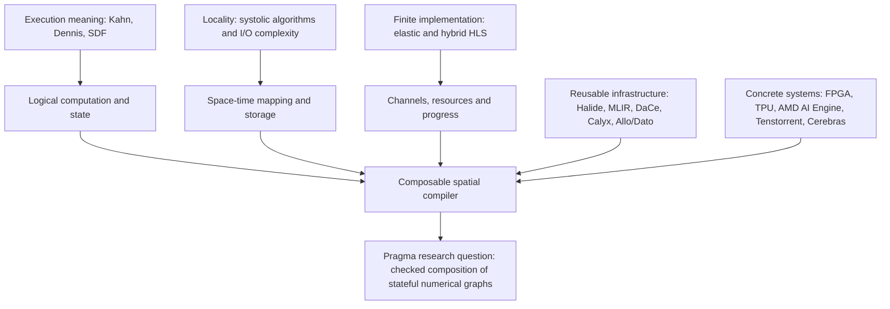

# Dataflow Programming Literatures

A curated reading collection on **dataflow programming, systolic algorithms, spatial architectures and high-level compilation**. It connects the foundational models to current compiler implementations and to the design of [Pragma HLS / MIMD_dataflow](https://github.com/lingzhi227/MIMD_dataflow).

For readers familiar with CUDA: a tensor graph describes dependencies; a spatial implementation must also decide where values live, how they travel, when buffers can be reused, and how finite resources keep making progress. This collection follows those questions across theory, algorithms and working systems.

**Snapshot: 10 September 2026 · 38 papers · 8 full main-text readings · 5 upstream source audits plus Pragma.** There are 10 licence-verified PDF mirrors; all other entries link to their sources. Downloading a paper does not mean its full text was reviewed. This is a selected research collection, not an exhaustive history or a benchmark leaderboard.

## Research map

Arrows show conceptual relationships, not a claim of direct historical descent. MIMD, dataflow and systolic describe different aspects of a system. The catalogue below supplies the underlying papers; the [design study](research/pragma-hls-design.md) distinguishes evidence from proposed work.

## Repository guide

| Location | What readers will find |
|---|---|
| [Paper catalogue below](#paper-catalogue) | Every paper, year, authors, venue/status, links and one-sentence introduction |
| [Reading guide](docs/READING_GUIDE.md) | Suggested routes for GPU programmers, compiler researchers and HLS designers |
| [Reading notes](notes/reading-notes.md) | Eight full main-text reviews, with read scope and limitations |
| [Code ecosystem](notes/code-ecosystem.md) | Pinned implementation files and what was actually inspected |
| [Pragma design study](research/pragma-hls-design.md) | Architecture proposal, migration plan and completion gates |
| [中文设计解读](research/pragma-hls-design.zh-CN.md) | 中文结论、现有实现边界和建议路线 |
| [Machine-readable catalogue](catalog/papers.json) · [CSV](catalog/papers.csv) · [BibTeX](references.bib) | Reusable metadata; abbreviated author lists are labelled |
| [PDFs and attribution](papers/ATTRIBUTION.md) | Unmodified permitted copies, sources, versions and licences |
| [Methodology](docs/METHODOLOGY.md) · [Access report](docs/ACCESS_REPORT.md) | Selection, reading depth, retrieval outcomes and known limits |
| [Collection policy](docs/COLLECTION_POLICY.md) | How to add, cite, version and redistribute material |

## Paper catalogue

Within each topic, papers appear newest first. **Full** = full main body read, with version-specific notes; **Targeted** = selected content reviewed; **Indexed** = metadata/abstract or discovery-level inspection. A PDF link is an external source; **Mirror** is a checked-in copy. Published venue and preprint/workshop status are kept distinct.

### Foundations: semantics, actors and streams

| Year | Paper / authors | Venue or status | One-sentence introduction | Access / review |
|---|---|---|---|---|
| 2002 | **StreamIt: A Language for Streaming Applications** William Thies et al. | CC | Introduces structured stream programming with filters, pipelines and feedback. | [Source](https://groups.csail.mit.edu/cag/streamit/papers/streamit-cc.pdf) Indexed |
| 2001 | **Theory of Latency-Insensitive Design** Luca P. Carloni et al. | IEEE TCAD | Provides a framework for composing synchronous components despite variable communication latency. | [Source](https://www.cs.columbia.edu/~luca/research/lipTransactions.pdf) Indexed |
| 1987 | **Static Scheduling of Synchronous Data Flow Programs for Digital Signal Processing** Edward A. Lee and David G. Messerschmitt | IEEE TC | Develops static scheduling theory for networks with fixed production and consumption rates. | [Source](https://ptolemy.berkeley.edu/publications/papers/87/staticscheduling/) · [PDF](https://ptolemy.berkeley.edu/publications/papers/87/staticscheduling/staticscheduling.pdf) Indexed |
| 1975 | **A Preliminary Architecture for a Basic Data-Flow Processor** Jack B. Dennis and David P. Misunas | ISCA | Describes an early data-driven processor with explicit actors, control and feedback. | [Source](https://www.cs.cmu.edu/~15740-f20/papers/dennis-75.pdf) Full |
| 1974 | **The Semantics of a Simple Language for Parallel Programming** Gilles Kahn | IFIP | Defines deterministic parallel computation through stream histories and process networks. | [Source](https://www.cs.columbia.edu/~sedwards/papers/kahn1974semantics.pdf) Full |
| 1972 | **Some Computer Organizations and Their Effectiveness** Michael J. Flynn | IEEE TC | Introduces the instruction/data-stream taxonomy that makes MIMD a precise architectural term. | [Source](https://users.cs.utah.edu/~hari/teaching/paralg/Flynn72.pdf) Indexed |

### Systolic algorithms, storage and performance

| Year | Paper / authors | Venue or status | One-sentence introduction | Access / review |
|---|---|---|---|---|
| 2021 | **AutoSA: A Polyhedral Compiler for High-Performance Systolic Arrays on FPGA** Jie Wang et al. | FPGA | Generates FPGA systolic arrays through polyhedral transformation and architecture optimization. | [Source](https://github.com/UCLA-VAST/AutoSA) · [PDF](http://cadlab.cs.ucla.edu/~jaywang/papers/fpga21-autosa.pdf) Indexed |
| 2017 | **In-Datacenter Performance Analysis of a Tensor Processing Unit** Norman P. Jouppi et al. | ISCA | Analyzes a deployed TPU and supplies a concrete systolic-accelerator comparison point. | [Source](https://arxiv.org/abs/1704.04760) · [PDF](https://arxiv.org/pdf/1704.04760v1) Indexed |
| 2017 | **Plasticine: A Reconfigurable Architecture for Parallel Patterns** Raghu Prabhakar et al. | ISCA | Explores a reconfigurable spatial architecture organized around parallel computation patterns. | [Source](https://ppl.stanford.edu/papers/isca17-raghu-plasticine.pdf) Indexed |
| 2009 | **Roofline: An Insightful Visual Performance Model for Multicore Architectures** Samuel Williams et al. | CACM | Relates attainable performance to compute throughput and data-movement intensity. | [Source](https://doi.org/10.1145/1498765.1498785) · [PDF](https://crd.lbl.gov/assets/pubs_presos/roofline/roofline-CACM.pdf) Indexed |
| 1982 | **Why Systolic Architectures?** H. T. Kung | IEEE Computer | Explains systolic locality and why different space-time schedules trade I/O, storage and utilization. | [Source](https://www.eecs.harvard.edu/~htk/publication/1982-kung-why-systolic-architecture.pdf) Full |
| 1981 | **I/O Complexity: The Red-Blue Pebble Game** Jia-Wei Hong and H. T. Kung | STOC | Provides an I/O-complexity model for reasoning about computation under limited fast storage. | [Source](https://perso.ens-lyon.fr/loris.marchal/docs-data-aware/hong_kung_red_blue_pebble_game_STOC81.pdf) Indexed |

### Programming models and compiler infrastructure

| Year | Paper / authors | Venue or status | One-sentence introduction | Access / review |
|---|---|---|---|---|
| 2026 | **Is It a Good Idea to Build an HLS Tool on Top of MLIR? Experience from Building the Dynamatic HLS Compiler** Jiahui Xu et al. | LATTE workshop | Reports practical benefits and difficulties of building an HLS compiler on MLIR. | [Source](https://arxiv.org/abs/2603.19856) · [PDF](https://arxiv.org/pdf/2603.19856v1) · [Mirror](papers/2026/xu2026mlir.pdf) Targeted |
| 2025 | **Dato: A Task-Based Programming Model for Dataflow Accelerators** Shihan Fang et al. | preprint | Makes task communication and sharding explicit in a programming model for dataflow accelerators. | [Source](https://arxiv.org/abs/2509.06794) · [PDF](https://arxiv.org/pdf/2509.06794v1) · [Mirror](papers/2025/fang2025dato.pdf) Targeted |
| 2024 | **Allo: A Programming Model for Composable Accelerator Design** Hongzheng Chen et al. | PLDI | Composes accelerator customization through checked interfaces and reusable schedules. | [Source](https://www.csl.cornell.edu/~zhiruz/pdfs/allo-pldi2024.pdf) Full |
| 2022 | **Exocompilation for Productive Programming of Hardware Accelerators** Yuka Ikarashi et al. | PLDI | Moves hardware instructions and scheduling policy into user-extensible libraries and checked rewrites. | [Source](https://doi.org/10.1145/3519939.3523446) · [PDF](https://people.csail.mit.edu/yuka/pdf/exo_pldi2022_full.pdf) Indexed |
| 2021 | **A Compiler Infrastructure for Accelerator Generators** Rachit Nigam et al. | ASPLOS | Presents Calyx, an accelerator IR combining structural datapaths with explicit control. | [Source](https://www.cs.cornell.edu/~asampson/media/papers/calyx-asplos2021.pdf) Indexed |
| 2021 | **MLIR: Scaling Compiler Infrastructure for Domain Specific Computation** Chris Lattner et al. | CGO | Introduces reusable multilevel compiler infrastructure for domain-specific representations and lowering. | [Source](https://mlir.llvm.org/pubs/) · [PDF](https://arxiv.org/pdf/2002.11054) Indexed |
| 2019 | **Stateful Dataflow Multigraphs: A Data-Centric Model for Performance Portability on Heterogeneous Architectures** Tal Ben-Nun et al. | SC | Makes data movement and state explicit in a graph representation for heterogeneous optimization. | [Source](https://spcl.inf.ethz.ch/Publications/.pdf/dace-sc19.pdf) Indexed |
| 2019 | **Triton: An Intermediate Language and Compiler for Tiled Neural Network Computations** Philippe Tillet et al. | MAPL workshop | Introduces a tiled programming and compilation approach for neural-network kernels. | [Source](https://www.eecs.harvard.edu/~htk/publication/2019-mapl-tillet-kung-cox.pdf) Indexed |
| 2018 | **Spatial: A Language and Compiler for Application Accelerators** David Koeplinger et al. | PLDI | Offers a language and compiler for expressing and optimizing application accelerators. | [Source](https://ppl.stanford.edu/papers/spatial18.pdf) Indexed |
| 2018 | **TVM: An Automated End-to-End Optimizing Compiler for Deep Learning** Tianqi Chen et al. | OSDI | Connects graph optimization, tensor compilation and hardware-aware tuning in a learning compiler stack. | [Source](https://www.usenix.org/system/files/osdi18-chen.pdf) Indexed |
| 2016 | **TensorFlow: A System for Large-Scale Machine Learning** Martin Abadi et al. | OSDI | Explains a graph-based machine-learning system spanning heterogeneous and distributed execution. | [Source](https://www.usenix.org/conference/osdi16/technical-sessions/presentation/abadi/) · [PDF](https://www.usenix.org/system/files/conference/osdi16/osdi16-abadi.pdf) Indexed |
| 2013 | **Halide: A Language and Compiler for Optimizing Parallelism, Locality, and Recomputation in Image Processing Pipelines** Jonathan Ragan-Kelley et al. | PLDI | Separates image-processing algorithms from schedules controlling parallelism, locality and recomputation. | [Source](https://people.csail.mit.edu/jrk/halide-pldi13.pdf) Indexed |

### Elastic, task-parallel and hybrid HLS

| Year | Paper / authors | Venue or status | One-sentence introduction | Access / review |
|---|---|---|---|---|
| 2025 | **CRUSH: A Credit-Based Approach for Functional Unit Sharing in Dynamically Scheduled HLS** Jiahui Xu and Lana Josipović | ASPLOS | Uses credits to coordinate functional-unit sharing in dynamically scheduled HLS. | [Source](https://doi.org/10.1145/3669940.3707273) · [PDF](https://dynamo.ethz.ch/wp-content/uploads/2025/06/Xu_ASPLOS25_CRUSH.pdf) · [Mirror](papers/2025/crush2025.pdf) Indexed |
| 2025 | **ElasticMiter: Formally Verified Dataflow Circuit Rewrites** Ayatallah Elakhras et al. | ASPLOS | Studies formal validation of rewrites in elastic dataflow circuits. | [Source](https://www.epfl.ch/labs/lap/wp-content/uploads/2026/03/ElakhrasMar25-ElasticMiter-Formally-Verified-Dataflow-Circuit-Rewrites-ASPLOS25.pdf) · [Mirror](papers/2025/elasticmiter2025.pdf) Indexed |
| 2025 | **Resource and Phase Awareness for Dynamically Scheduled High-Level Synthesis** Mathias Bouilloud et al. | HEART | Introduces resource and execution-phase awareness into dynamically scheduled HLS. | [Source](https://dynamo.ethz.ch/wp-content/uploads/2025/06/Bouilloud_HEART25_ResourceAndPhaseAwareness.pdf) · [Mirror](papers/2025/bouilloud2025.pdf) Indexed |
| 2024 | **Suppressing Spurious Dynamism of Dataflow Circuits via Latency and Occupancy Balancing** Jiahui Xu and Lana Josipović | FPGA | Studies latency and occupancy balancing to reduce unnecessary dynamism in dataflow circuits. | [Source](https://dynamo.ethz.ch/wp-content/uploads/2024/04/Xu_FPGA24_SuppressingSpuriousDynamism.pdf) · [Mirror](papers/2024/xu2024.pdf) Indexed |
| 2022 | **DASS: Combining Dynamic & Static Scheduling in High-Level Synthesis** Jianyi Cheng et al. | IEEE TCAD | Combines statically scheduled regions with dynamically scheduled surrounding computation. | [Source](https://doi.org/10.1109/TCAD.2021.3065902) · [PDF](https://dynamo.ethz.ch/wp-content/uploads/2022/06/Cheng_TCAD21_DASSCombiningDynamicAndStaticSchedulinginHighLevelSynthesis.pdf) Indexed |
| 2021 | **Extending High-Level Synthesis for Task-Parallel Programs** Yuze Chi et al. | FCCM | Extends HLS with task-parallel programming and stream-based communication. | [Source](https://doi.org/10.1109/FCCM51124.2021.00032) · [PDF](https://jasonlau.io/research-papers/10.1109-FCCM51124.2021.00032.pdf) Indexed |
| 2020 | **Dynamatic: From C/C++ to Dynamically Scheduled Circuits** Lana Josipovic et al. | FPGA | Presents a tool for translating C/C++ into dynamically scheduled dataflow circuits. | [Source](https://dynamo.ethz.ch/wp-content/uploads/2022/06/Josipovic_FPGA20_DynamaticFromCCToDynamicallyScheduledCircuits.pdf) Indexed |

### Modern spatial mapping and wafer-scale execution

| Year | Paper / authors | Venue or status | One-sentence introduction | Access / review |
|---|---|---|---|---|
| 2026 | **Eliminating Redundancy: Ultra-compact Code Generation for Programmable Dataflow Accelerators** Prasanth Chatarasi et al. | CGO | Addresses finite instruction storage through compiler transformations that compact generated code. | [Source](https://research.ibm.com/publications/eliminating-redundancy-ultra-compact-code-generation-for-programmable-dataflow-accelerators) Indexed |
| 2025 | **A System Level Compiler for Massively-Parallel, Spatial, Dataflow Architectures** Dirk Van Essendelft et al. | preprint | Describes MACH, a system-level spatial compiler using a distributed controller/worker virtual machine. | [Source](https://arxiv.org/abs/2506.15875) · [PDF](https://arxiv.org/pdf/2506.15875v1) · [Mirror](papers/2025/vanessendelft2025.pdf) Full |
| 2025 | **ARIES: An Agile MLIR-Based Compilation Flow for Reconfigurable Devices with AI Engines** Jinming Zhuang et al. | FPGA | Unifies compilation across AI Engine cores, arrays and associated programmable logic. | [Source](https://www.jinmingzhuang.com/publication/fpga25_aries/) · [PDF](https://www.csl.cornell.edu/~zhiruz/pdfs/aries-fpga2025.pdf) · [Mirror](papers/2025/aries2025.pdf) Indexed |
| 2025 | **From Loop Nests to Silicon: Mapping AI Workloads onto AMD NPUs with MLIR-AIR** Erwei Wang et al. | preprint | Describes hierarchical asynchronous compilation from loop nests to AMD NPU resources. | [Source](https://arxiv.org/abs/2510.14871) · [PDF](https://arxiv.org/pdf/2510.14871v1) · [Mirror](papers/2025/wang2025air.pdf) Full |
| 2025 | **Rewire: Advancing CGRA Mapping Through a Consolidated Routing Paradigm** Zhaoying Li et al. | DAC | Studies routing-aware mapping for coarse-grained reconfigurable arrays. | [Source](https://ieeexplore.ieee.org/document/11133240/) · [PDF](https://www.comp.nus.edu.sg/~tulika/DAC25.pdf) Indexed |
| 2025 | **TL: Automatic End-to-End Compiler of Tile-Based Languages for Spatial Dataflow Architectures** Wei Li et al. | preprint | Maps tile-language computations onto spatial cores using device constraints and mapping search. | [Source](https://arxiv.org/abs/2512.22168) · [PDF](https://arxiv.org/pdf/2512.22168v1) · [Mirror](papers/2025/li2025tl.pdf) Full |
| 2025 | **WaferLLM: Large Language Model Inference at Wafer Scale** Congjie He et al. | OSDI | Develops mesh-aware LLM algorithms and evaluates inference on a wafer-scale processor. | [Source](https://www.usenix.org/system/files/osdi25-he.pdf) Full |

## Update log — newest first

### 2026-09-10 — Initial curated release

- Indexed 38 works from 1972–2026 across five themes, with metadata, original links and concise introductions.
- Added eight full main-text reviews, five pinned upstream code audits and a Pragma source audit.
- Added an English design study, Chinese explanation, conceptual diagrams and milestone completion gates.
- Included 10 unmodified, licence-verified PDF mirrors with checksums and attribution; documented unavailable downloads separately.
- Publication checks validate catalogue consistency, local document links and every mirrored PDF's hash and header. This does not constitute compiler or hardware validation.
