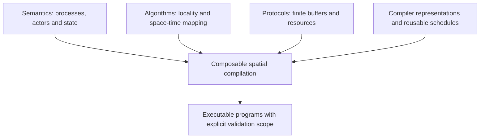

# Dataflow programming: a literature review

The recurring question in this literature is how to turn dependencies into efficient execution while retaining a useful way to reason about program behavior. Four concerns recur: meaning, locality, finite resources and composition. Their relationship is more informative than treating every use of “dataflow” as the same programming model.

## Meaning and execution

[Kahn's process networks](https://www.cs.columbia.edu/~sedwards/papers/kahn1974semantics.pdf) provide a semantic starting point; [Dennis and Misunas](https://www.cs.cmu.edu/~15740-f20/papers/dennis-75.pdf) make data-driven execution concrete in a processor design. [Lee and Messerschmitt](https://ptolemy.berkeley.edu/publications/papers/87/staticscheduling/) study the scheduling opportunities created by fixed token rates. Together they motivate a distinction between mathematical behavior and the protocol used to execute it with finite buffers.

For compiler design, a graph edge needs a defined meaning. It may denote a tensor value, an ordered stream, a memory dependency or a physical channel. State, control and feedback need equally explicit interpretation. A pure dependency DAG is useful for some computations but does not cover every iterative numerical program.

## Locality and space-time mapping

[Systolic architectures](https://www.eecs.harvard.edu/~htk/publication/1982-kung-why-systolic-architecture.pdf) connect algorithm design to data reuse and communication. The [red-blue pebble game](https://perso.ens-lyon.fr/loris.marchal/docs-data-aware/hong_kung_red_blue_pebble_game_STOC81.pdf) and [Roofline](https://doi.org/10.1145/1498765.1498785) offer complementary ways to reason about storage and traffic. [AutoSA](https://github.com/UCLA-VAST/AutoSA) supplies a compiler example of turning loop computations into FPGA systolic arrays.

The design implication is to retain multiple mappings for one algorithm. Placement, tiling and movement determine buffering and utilization. A schedule that works well for a dense regular kernel need not serve a reduction, sparse solver or persistent-state workload equally well.

## Programming models and compiler representations

[Halide](https://people.csail.mit.edu/jrk/halide-pldi13.pdf), [Exo](https://doi.org/10.1145/3519939.3523446) and [Allo](https://www.csl.cornell.edu/~zhiruz/pdfs/allo-pldi2024.pdf) make scheduling and hardware customization reusable concerns. [Dato](https://arxiv.org/abs/2509.06794v1) brings task communication and layout into the programming interface. [DaCe](https://spcl.inf.ethz.ch/Publications/.pdf/dace-sc19.pdf) and [Calyx](https://www.cs.cornell.edu/~asampson/media/papers/calyx-asplos2021.pdf) provide contrasting approaches to representing state, movement and control.

These works motivate an interface between mathematical computation and physical implementation that can survive composition. For a spatial compiler, that interface should cover both values and execution obligations. Compatible shapes alone do not guarantee compatible communication order, state ownership or resource lifetimes.

## Finite resources and current spatial systems

Elastic and hybrid HLS supplies relevant techniques for finite implementations: [DASS](https://doi.org/10.1109/TCAD.2021.3065902) combines scheduling styles, [CRUSH](https://doi.org/10.1145/3669940.3707273) addresses sharing through credits, and [ElasticMiter](https://www.epfl.ch/labs/lap/wp-content/uploads/2026/03/ElakhrasMar25-ElasticMiter-Formally-Verified-Dataflow-Circuit-Rewrites-ASPLOS25.pdf) examines verified rewrites. [Resource and phase awareness](https://dynamo.ethz.ch/wp-content/uploads/2025/06/Bouilloud_HEART25_ResourceAndPhaseAwareness.pdf) is another relevant direction. Their hardware context differs from CSL, so the abstraction must be adapted rather than assumed equivalent.

[AIR](https://arxiv.org/abs/2510.14871v1), [ARIES](https://www.csl.cornell.edu/~zhiruz/pdfs/aries-fpga2025.pdf) and [TL](https://arxiv.org/abs/2512.22168v1) connect high-level computation to physical spatial resources. [WaferLLM](https://www.usenix.org/conference/osdi25/presentation/he) and [MACH](https://arxiv.org/abs/2506.15875v1) bring direct wafer-scale experience. For Pragma, the next question is how to retain useful target-specific schedules while reducing the need for a special compiler path for every complete graph.

This is a conceptual synthesis, not a claim of one direct historical lineage. The proposed Pragma architecture and completion gates are in the [design study](pragma-hls-design.md), with a [Chinese explanation](pragma-hls-design.zh-CN.md).

## Scope

The 10 September 2026 review covers 38 selected papers. Eight main bodies were read in full: Kahn, Dennis/Misunas, Kung, Allo, MACH v1, AIR v1, TL v1 and WaferLLM. Dato and the 2026 Dynamatic/MLIR experience report received targeted review; the other entries remain discovery-level. Full reading scopes and limitations are recorded in [reading-notes.md](reading-notes.md); five upstream projects and Pragma were inspected at pinned commits in [code-ecosystem.md](code-ecosystem.md). No toolchain was built or benchmarked for this review.

The selection emphasizes compiler design for Pragma. It does not exhaust tagged-token history, formal concurrency, numerical algorithm families or commercial serving systems. Current repositories may differ from the implementations described in their papers. The architecture proposal is a research synthesis, not an implemented capability or a proof of historical novelty.
