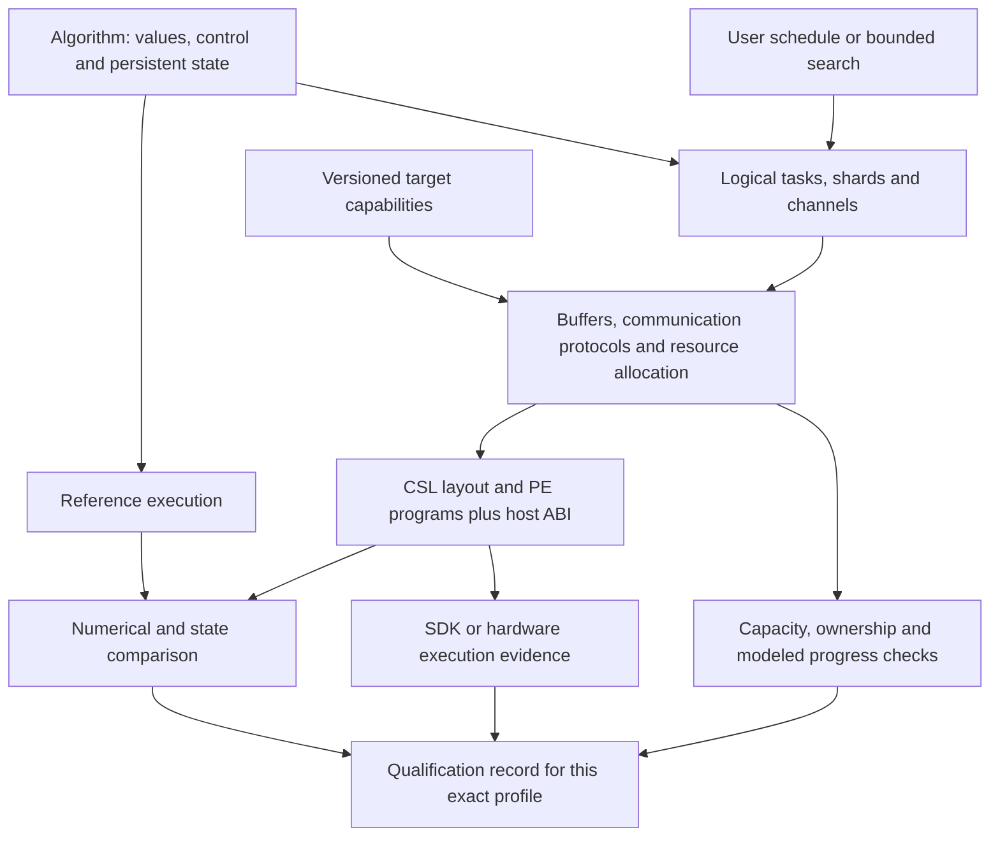

# Pragma HLS: from validated examples to compositional spatial compilation

**Research and design proposal · 10 September 2026**

Pragma should target **compositional compilation of stateful numerical graphs into bounded spatial programs**, using Cerebras CSL as the first backend. The next research milestone should demonstrate that independently specified kernels can be combined safely without adding a compiler path for each complete graph.

This recommendation follows a curated 38-paper survey, eight full main-text readings, and a read-only audit of five upstream implementations and the published Pragma snapshot. It is a proposal, not an announcement of implemented features. No compiler build, SDK simulation, hardware experiment or model run was performed for this study. The collection is selective; it does not establish that a proposed contribution is historically unique.

## 1. The historical lessons that matter

Four questions are often compressed into the word “dataflow”:

| Question | Relevant tradition | Consequence for Pragma |
|---|---|---|
| What does a concurrent program mean? | Kahn process networks; dataflow actors; synchronous dataflow | Define value, ordering, state and feedback semantics before physical scheduling. |
| Where and when should work execute? | Systolic algorithms; polyhedral compilation; explicit scheduling | Treat space-time mapping as a choice, not as the identity of an algorithm. |
| How does a finite implementation remain safe and make progress? | Latency-insensitive, elastic and hybrid HLS | Represent buffer capacity, backpressure, control and completion. |
| How can these decisions be reused across programs and targets? | Halide, Exo, Allo/Dato, MLIR, DaCe, AIR | Separate semantic interfaces from scheduling policy and target implementation. |

Sources: [Kahn](https://www.cs.columbia.edu/~sedwards/papers/kahn1974semantics.pdf), [Dennis and Misunas](https://www.cs.cmu.edu/~15740-f20/papers/dennis-75.pdf), [Lee and Messerschmitt](https://ptolemy.berkeley.edu/publications/papers/87/staticscheduling/), [Kung](https://www.eecs.harvard.edu/~htk/publication/1982-kung-why-systolic-architecture.pdf), [Allo](https://www.csl.cornell.edu/~zhiruz/pdfs/allo-pldi2024.pdf), [Dato](https://arxiv.org/abs/2509.06794v1), and the linked bibliography. These connections are our synthesis, not a claim of a single direct historical lineage.

MIMD classifies instruction/data streams; dataflow describes dependency-driven execution. Systolic scheduling is a structured spatial execution technique. A tensor dependency graph does not itself specify physical channels, finite storage or a progress protocol. GPUs, FPGAs and programmable spatial processors can all execute graphs, with different placement and communication responsibilities.

For a CUDA reader, the important shift is which decisions become persistent compiler responsibilities. Tiling and asynchronous copies already matter on GPUs; a spatial compiler must additionally describe which distributed memories and communication resources hold a graph throughout its execution. This is not an argument that GPUs cannot implement dataflow. See [Triton](https://doi.org/10.1145/3315508.3329973), [TVM](https://www.usenix.org/conference/osdi18/presentation/chen), and [MLIR-AIR](https://arxiv.org/abs/2510.14871v1).



## 2. What the existing project already contributes

The audited baseline is [MIMD_dataflow at dc14c0d](https://github.com/lingzhi227/MIMD_dataflow/tree/dc14c0df54b12cb9e47ae710e2215084154c9570), not an uninspected development checkout. It has typed graph input, explicit precision/range policies, mathematical references, constrained planners, concrete CSL generation and historical validation receipts. These are valuable assets to preserve.

The architectural limitation is **family-specific composition**. The central verifier selects specialized paths using operation combinations and policies. A downstream composed attention/FFN verifier then checks an exact 35-node topology, including residual structure, shared normalization and coverage. This is stronger than simply counting operators; the dispatch is not evidence of accepting invalid graphs. However, new graph families still tend to require new whole-pattern logic. [Verifier source](https://github.com/lingzhi227/MIMD_dataflow/blob/dc14c0df54b12cb9e47ae710e2215084154c9570/lib/IR/ir.py), [composed graph source](https://github.com/lingzhi227/MIMD_dataflow/blob/dc14c0df54b12cb9e47ae710e2215084154c9570/lib/IR/projected_cache_ffn_ir.py).

The lifetime checker validates declared storage overlap and resource leases. Its documented scope excludes arbitrary CSL control flow, dynamic stack and compiler/SDK temporaries. The extension needed is to connect declarations to the actual events generated by lowering. This is a scope boundary, not a demonstrated failure. [Lifetime checker](https://github.com/lingzhi227/MIMD_dataflow/blob/dc14c0df54b12cb9e47ae710e2215084154c9570/lib/Analysis/region_lifetimes.py).

The published documentation's 141 historically qualified bounded profiles remain historical evidence. The audited 35-node composed candidate was pending full SDK qualification. Neither number means arbitrary shapes, new compiler versions, or a full LLM have been validated. Directory names resembling MLIR organization also do not establish an implemented MLIR dialect.

## 3. Proposed programming model

### Algorithm and state

Keep an approachable typed frontend and an independent reference interpreter. The source program should specify tensors, structured control, persistent state and numerical policy. Shape constraints, sparse formats, convergence conditions and reset behavior belong to the contract. A stateful program is not forced into a pure acyclic tensor graph.

Support three explicit levels of user control:

1. **Algorithm:** write the computation and state transitions; choose a supported policy.
2. **Schedule:** select shards, tiling, pipeline stages, collectives and resource budgets without rewriting the mathematical definition.
3. **Primitive:** supply an optimized CSL implementation behind the same checked interface.

A scheduling rewrite must state which semantic conditions it preserves. Changing reduction order is a numerical-policy decision. FP16 storage, FP32 accumulation, approximate functions, overflow bounds and contraction rules should be independently visible. A single global tolerance is insufficient for every algorithm.

### Four semantic layers

| Layer | Objects to represent | Required checks |
|---|---|---|
| Algorithm/state | Tensors, loops, effects, state versions, numeric policy | Shapes, types, effects, reference meaning |
| Spatial execution | Regions, actors/tasks, shards, logical channels, collectives | Interface compatibility, dependencies, token order, legal partitioning |
| Resource/protocol | Physical buffers, ownership, completion events, routes, queues, task/descriptor leases | Capacity, conflict, lifetime and restricted progress properties |
| CSL target | Versioned capabilities, physical layout, PE code, host transfers | Supported lowering, resource accounting, execution qualification |

Logical channels should have explicit identity and endpoint semantics. A tensor SSA value is not enough to carry routing, capacity and completion obligations implicitly. Use hierarchical regions so that a verified primitive can be instantiated more than once without sharing mutable state accidentally.

### The primitive contract

Each primitive should expose its mathematical function or state transition; input/output shapes and layouts; precision and error policy; communication ordering; scratch/code requirements; state ownership; resource needs; completion events; and supported target profiles. Its implementation can be handwritten CSL or generated code.

For opaque CSL, the declared interface is a trusted boundary until checked against implementation behavior. Numerical tests alone cannot certify the contract's communication and lifetime claims. Preserve the source hash and the qualification scope of each primitive instance.

## 4. Make completion precise

“Done” should not be one universal event. A communication operation can have distinct milestones:

| Event | What it permits |
|---|---|
| Send issued | A transfer has been requested; it does not automatically permit source reuse. |
| Source released | The sending engine and every reader covered by the contract have finished reading the source. |
| Receive complete | The destination is ready for the declared consumer. |
| Consumer complete | That consumer no longer needs the destination. |
| Resource drained | In-flight uses are finished and a route/queue/task lease can be reassigned under the target rules. |

Read-only fanout requires tracking all borrowers. A persistent state update needs one well-defined owner and a visible version transition. For KV cache, associate each update with request/epoch and token position; for iterative solvers, associate it with an iteration. Reset must drain relevant work before reinitializing or recycling state.

For example, in `x → projection → y`, with `x` also feeding a residual addition, `x` remains live until both uses finish. A kernel finishing its local arithmetic does not prove that an asynchronous sender has released its buffer. This is an original proposed acceptance case, not a bug observed in the audited implementation.

The physical event definitions must be derived from the exact SDK backend. If a completion event cannot be established, the compiler should retain a conservative lifetime or reject the optimization. It should not invent a release point.

## 5. Bounded progress is a separate obligation

Kahn's semantic model and a finite hardware network are different levels of description. For fixed-rate channels, the balance equation `q_A p = q_B c` constrains a repetition schedule; it is not by itself a deadlock proof. Initial tokens, channel capacities, actor firing rules and resource dependencies also matter. [Kahn](https://www.cs.columbia.edu/~sedwards/papers/kahn1974semantics.pdf), [Lee and Messerschmitt](https://ptolemy.berkeley.edu/publications/papers/87/staticscheduling/).

Start with a restricted static subset and a finite event model for bounded instances. State explicitly whether a result is a static proof within that subset, exhaustive checking of a finite model, a simulation trace, or an unverified assertion. General arbitrary-program progress is not a reasonable initial promise.

Useful rejection cases include a feedback cycle with no enabling token; two actors holding resources while waiting for each other; correct values delivered in the wrong order; early buffer reuse under backpressure; and a reset racing with an outstanding transfer. Tests should demonstrate distinctions that numerical comparison alone misses.

## 6. Reuse infrastructure selectively

Use MLIR incrementally if it improves a concrete vertical slice. Reuse established tensor, arithmetic, loop and memory representations where their semantics match. Add explicit state/channel/resource constructs where they do not. Keep the existing Python reference and frozen CSL evidence while an adapter is evaluated.

The five pinned source audits identify useful precedents: Allo/Dato for composable schedules and task interfaces; AIR for asynchronous hierarchy and lowering; DaCe for state/data separation; Calyx for explicit orchestration; WaferLLM for concrete wafer algorithms. None is automatically a complete Pragma backend. [Source audit](code-ecosystem.md).

The 2026 Dynamatic experience report raises practical risks around edge metadata, control representation and mismatched LLVM dependencies. Test these during integration rather than assuming that adopting MLIR resolves semantic design. [LATTE report](https://arxiv.org/abs/2603.19856v1).

MACH is relevant prior art for high-level compilation and code/control organization on spatial machines. The reviewed version lowers to Tungsten/Paint; it is not evidence of a public CSL replacement. WaferLLM contributes mesh-specific algorithm choices; it does not settle the frontend/compiler design. [MACH v1](https://arxiv.org/abs/2506.15875v1), [WaferLLM](https://www.usenix.org/conference/osdi25/presentation/he).

**Recommended first experiment:** implement a small adapter representing one graph through algorithm, spatial and protocol layers, with an inspectable CSL lowering. Compare the effort and preserved information against the existing Python IR. Choose the MLIR integration boundary after this result, before a broad rewrite or second backend.

## 7. Migration and completion gates

These are proposed future milestones, not active development instructions or elapsed-time estimates.

| Milestone | Deliverable | Completion gate |
|---|---|---|
| M0: evidence baseline | Machine-readable feature/profile registry and frozen references | Every claim names source, target, inputs, numerical policy and validation status; pending remains pending. |
| M1: reusable contracts | Typed primitives, state/effects, interpreter | Composition type-checks; malformed shape/state/precision cases are rejected with explanations. |
| M2: generic composition | Common region composition and interface legalization | Previously unseen chains, residuals and fanout graphs compile without adding whole-graph dispatch cases. |
| M3: finite resource semantics | Buffers, leases, completion events and bounded event checker | Early reuse, ordering and blocked-cycle counterexamples are detected; supported proof/model boundaries are documented. |
| M4: CSL qualification | Versioned backend and bounded SDK profiles | Generated programs run, match references and obey declared budgets for named profiles on the exact SDK version. |
| M5: persistent applications | Repeated solver steps and attention/cache stages | Multi-step state and reset agree with reference; small end-to-end model evidence is distinct from operator evidence. |
| M6: broader portability | A justified second backend or additional algorithm class | Shared semantics are demonstrated across targets; unsupported features are explicit rather than silently approximated. |

M4 and model execution require a later authorized development/experiment phase. This study does not restart paused simulation or prescribe an unrequested model family.

M2's small graphs are diagnostic composition tests, not a claim that another GEMM run measures overall project maturity. Use existing demanding examples as regression evidence, and test new *combinations* to measure generality. A useful research result should reduce special compiler cases while retaining correctness and usable performance.

## 8. Evaluation and evidence schema

Use matched mathematical references, existing generated CSL and pinned manual CSL baselines. Control shape, sparsity, precision, PE grid, SDK/compiler versions and host-transfer inclusion. Record accuracy, state agreement, resource usage, device cycles, transfer traffic, compilation cost and simulator wall time separately. For resource accounting, include code, static data, scratch, stack and compiler/SDK reservations wherever measurable; identify every unaccounted component.

An experiment record should carry: graph and schedule hashes; primitive versions; input/seed and state initialization; target capability version; generated source/build hashes; validation methods and outcomes; numerical error; resource estimates versus measurements; run logs; and failure/timeout classification. A timeout can preserve a validated prefix only if that prefix's state and values were independently checked. It does not certify the unfinished computation.

Ablations should isolate compositional interfaces, completion-aware reuse, schedule selection and target specialization. Compare legal-but-conservative allocation against optimized reuse. Report regressions and cases rejected by the compiler, not only the fastest successes. Predicted cost must remain labelled predicted; shortlist profiling must remain distinct from static compilation.

## 9. Repository organization should follow these boundaries

The existing `lib/IR`, `Analysis`, `Transforms` and `Conversion` organization can be retained. A future change should introduce semantic modules within it rather than perform another cosmetic move:

```text
lib/IR/{algorithm,state,spatial,protocol}/
lib/Analysis/{shape,effects,ownership,capacity,progress}/
lib/Transforms/{scheduling,partitioning,bufferization}/
lib/Conversion/CSL/
runtime/csl/                 # contract-backed target primitives
targets/cerebras/            # versioned capability descriptions
test/{contracts,composition,protocol}/
examples/                   # readable source + schedule + reference
validation/                 # profile manifests and frozen evidence
docs/{semantics,architecture,backends}/
```

This is a proposed responsibility map, not a directory tree already implemented. Each example should show its algorithm, scheduling choice, generated-program entry, supported profile and exact evidence status on one page.

## 10. Research claim and unresolved decisions

A defensible research question is: **Can completion-aware contracts make stateful numerical graph composition on a resource-constrained spatial machine both reusable and checkable, while preserving competitive handwritten schedules?** Demonstrating that requires new compositions, counterexamples, baselines and ablations. It does not require claiming to invent dataflow, graph compilation or high-level wafer programming.

Unresolved decisions include the useful static subset for progress checking, visibility of backend completion events, expressiveness of an AIR adapter, the code-size cost of reusable dispatch, and the best division between programmer schedules and bounded search. These are the next experiments to plan. The existing prototype provides the references and concrete backend experience needed to ask them precisely.

## Evidence and reading material

- [Paper catalogue](../README.md#papers): complete curated list, metadata and one-line introductions.
- [Full-paper notes](reading-notes.md): eight main-text readings with version and limitation notes.
- [Pinned source audit](code-ecosystem.md): inspected upstream and Pragma files; no build claims.
- [Review scope](literature-review.md#scope): selection, follow-up additions and access limitations.
- [BibTeX](../papers/references.bib): bibliographic records; explicitly abbreviated author lists where applicable.
